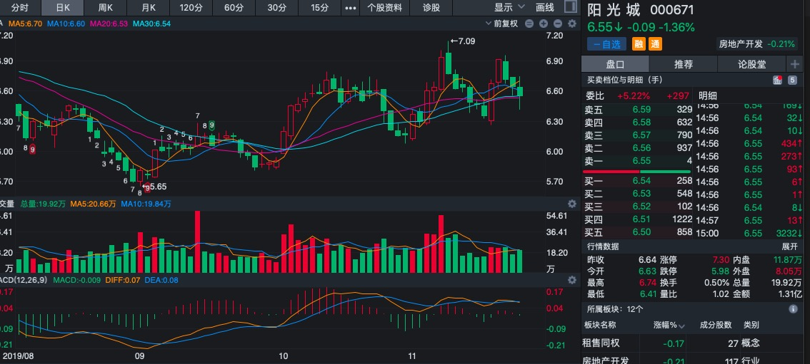
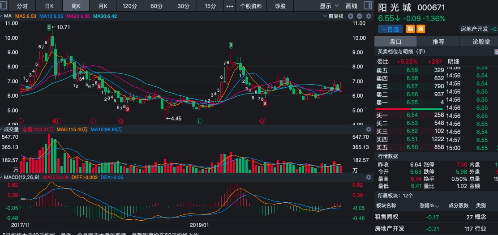

# 2019年11月23日

## 阳光城 
### 000671
 > 价格在日线图上下规律运行，上两次下跌在2～3%之间，上涨在 10～11%之间
 >周一如果价格能跌至6.34附近，建议买入
#### 日线图：

 ``` 
 1:30均线上升一段时间 --涨
 2:股价突破30日线 2% --有机会入
 3:macd线在上方 --小心
 4:macd值三红变绿 --参考
 ```
> 待周一开盘后看有没有可能降到30日均线3% 6.34，如果有则买入

 

#### 周线图：
```
1:30周线缓中带降 --后期不是很明朗
2:交易量持平 -价格稳定
```
 

#### 周线图：
```
1:均线交织在一块 --后期不是很明朗
2:macd在下方，略微上涨 --算了，还是不考虑他了
```
 