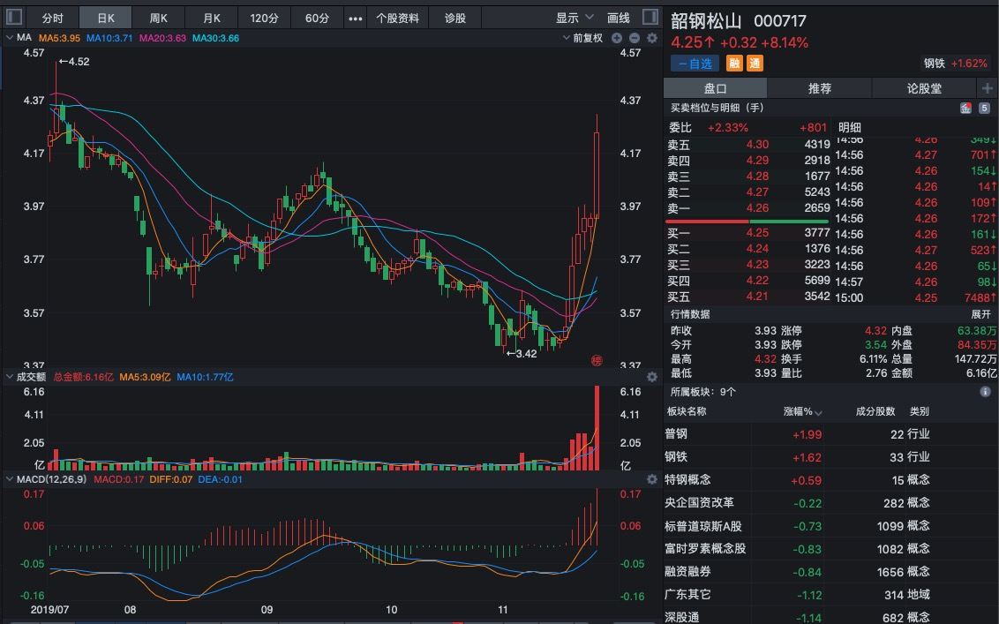
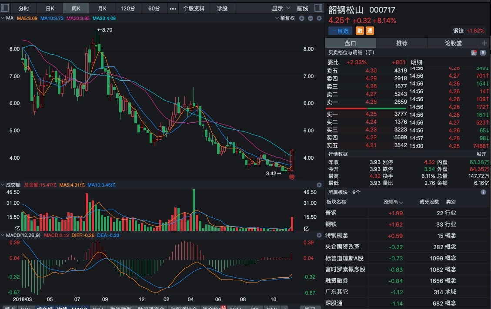
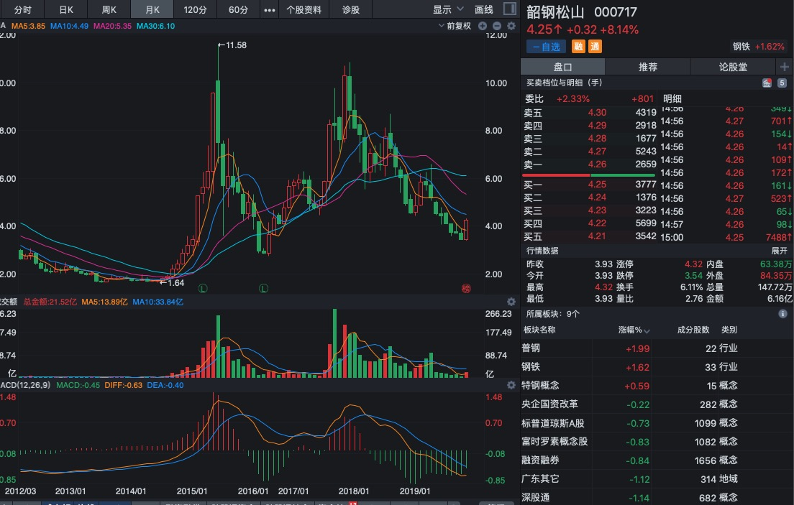

# 2019年11月23日


- [000717 韶钢松山](#韶钢松山)
- [000671 阳光城](#阳光城)


## 韶钢松山 
### 000717
> 等待价格回调至30日线下方8%～10%，
> 查看5月线图有没有拐点，如果有，坚决进入
> 预计日期：如果12个交易日突破均线，需密切关注

#### 日线图：
  
 ``` 
 1:30日均线出现拐点 -- 涨
 2:其他均线上涨 
 3:交易量放大2倍多 -- 风险增加
 4:macd曲线均突破0点，在上方 -- 风险增加
 5:macd值近日最大值 -- 危险
 ```
>  持续关注，等待股价跌破30日均线10%后入手

 

#### 周线图：

 ``` 
 1:均线呈下降趋势 --不利
 2:股价突破30均线 -- 涨
 3:5线出现上涨拐点 -- 涨
 4:交易量放大4倍 -- 风险增加
 5：macd线在下方， -- 有机会
 6: macd已翻红，上涨较多 -- 涨
 ``` 
 >  后期风险增加，机会比较小
 
 

#### 月线图：

 ```
 1:30线上升趋势变缓 --不利
 2:5线下降趋势反转 -- 涨
 3:交易量相对小很多 -- 有机会
 4:macd线值均在下方 -- 有机会
 6:连续下跌8个月，上涨了一个月，幅度比较大 很难说
 ```
  > 接下来的看月末图吧
  
 
## 阳光城 
### 000671
