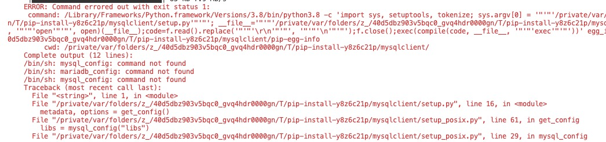

# 安装python
> 使用mac默认安装的python 2.7，需要下载更新：https://www.python.org/downloads/source/
# 安装pip
> 因为mac默认安装没有安装pip，所以要自己安装
````
sudo easy_install pip
````

# 安装依赖
```
-i http://mirrors.aliyun.com/pypi/simple/   --trusted-host mirrors.aliyun.com

pip3 install tushare pandas requests bs4 sqlalchemy mysqlclient lxml Anaconda Flask -i http://mirrors.aliyun.com/pypi/simple/   --trusted-host mirrors.aliyun.com

pip3 install  lxml Anaconda Flask -i http://mirrors.aliyun.com/pypi/simple/   --trusted-host mirrors.aliyun.com

```

# 安装 Ta-Lib
> mac python 3.8直接 pip3 install Ta-Lib 会提示错误，

1.所以只能手动安装。下载地址：
https://www.lfd.uci.edu/~gohlke/pythonlibs/
若本机安装是64位的python3.8，则选TA_Lib-0.4.17-cp38-cp38-win_amd64.whl下载

2. brew install ta-lib

# error
## 1 安装mysqlclient会提示

### 解决：
```
brew install mysql-connector-c 
cp /usr/local/bin/mysql_config /usr/local/bin/mysql_config.backup 
sudo vim /usr/local/bin/mysql_config 

# Create options 
libs="-L$pkglibdir"
libs="$libs -l "
修改成
# Create options 
libs="-L$pkglibdir"
libs="$libs -lmysqlclient -lssl -lcrypto"
```